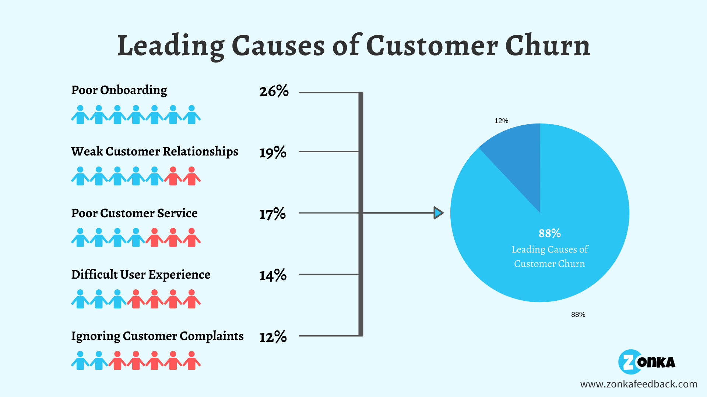

# Telecom Customer Churn Prediction

## Project Overview
This project involves developing a machine learning model to predict customer churn for a telecom company. The goal is to identify customers who are likely to leave the service, allowing the company to take proactive measures to retain them. The project follows a systematic approach of data preprocessing, feature engineering, model selection, and evaluation to achieve a robust predictive model.

## Project Description
The telecom industry is highly competitive, and customer retention is crucial for maintaining profitability. By accurately predicting customer churn, the company can implement targeted retention strategies to reduce churn rates. This project aims to build a predictive model that can reliably identify customers who are at risk of churning.

## Project Steps

### 1. Data Exploration and Preprocessing
- **Objective**: Understand the structure of the dataset and perform necessary preprocessing.
- **Steps**:
  - **Data Loading**: Loaded the dataset containing customer information and their churn status.
  - **Handling Missing Values**: Instead of dropping rows with missing values, replaced missing values in categorical columns with the placeholder `'unknown'`. This allows the model to interpret missing data as a potential feature rather than discarding it.
  - **Data Type Conversion**: Converted necessary columns, such as dates and numeric values, to appropriate data types for processing.
  - **Feature Transformation**: Transformed the `BeginDate` column into a numerical feature representing the tenure of the customer.

### 2. Feature Engineering
- **Objective**: Create new features and reduce multicollinearity by simplifying the dataset.
- **Steps**:
  - **Tenure Calculation**: Calculated the tenure of customers in months using the maximum date in the dataset to avoid data leakage.
  - **Consolidation of Features**: Consolidated service-specific columns into a single `NumServices` column, reducing multicollinearity and enhancing model interpretability.

### 3. Balancing the Dataset
- **Objective**: Address class imbalance in the target variable.
- **Steps**:
  - **SMOTE (Synthetic Minority Over-sampling Technique)**: Applied SMOTE to balance the dataset, ensuring that the model does not become biased towards the majority class (non-churned customers).

### 4. One-Hot Encoding
- **Objective**: Ensure consistent encoding of categorical features.
- **Steps**:
  - **One-Hot Encoding**: Applied one-hot encoding to categorical variables before splitting the dataset into training and testing sets. This prevents inconsistencies and potential data leakage during model training.

### 5. Model Selection and Training
- **Objective**: Identify the best-performing model for predicting customer churn.
- **Steps**:
  - **Model Testing**: Tested multiple machine learning models, including Logistic Regression, Random Forest, Gradient Boosting, XGBoost, LightGBM, and CatBoost.
  - **Hyperparameter Tuning**: Used GridSearchCV to optimize hyperparameters for XGBoost and CatBoost models.

### 6. Model Evaluation and Iteration
- **Objective**: Evaluate model performance and address potential issues.
- **Steps**:
  - **Model Evaluation**: Evaluated models using metrics such as accuracy, F1 score, and AUC-ROC score. XGBoost emerged as the best performer.
  - **Addressing Data Leakage**: Ensured consistent calculation of tenure by using a fixed date (maximum date in the dataset), eliminating data leakage.

### 7. Final Model Selection
- **Objective**: Select the best model for deployment.
- **Steps**:
  - **Final Model**: The XGBoost Classifier was selected as the final model due to its superior performance with an AUC-ROC score of 0.88 and an accuracy score of 0.92.

## Conclusion
The project successfully developed a machine learning model to predict customer churn with high accuracy. By following a structured approach to data preprocessing, feature engineering, and model selection, the project achieved its objective. The final XGBoost model provides a reliable solution for predicting customer churn and can be confidently used in practical applications.

## Key Achievements
- **Robust Model Performance**: The XGBoost model achieved an AUC-ROC score of 0.88 and an accuracy score of 0.92.
- **Effective Feature Engineering**: Transformed and engineered features to enhance model performance and interpretability.
- **Thorough Evaluation**: Systematically tested multiple models and tuned hyperparameters to identify the best-performing model.

## Difficulties and Solutions
- **Handling Missing Values**: Initially dropped rows with NaN values but later filled them with `'unknown'` based on reviewer feedback, preserving valuable information.
- **Avoiding Data Leakage**: Corrected the potential data leakage by using the maximum date in the dataset instead of the current date.
- **Consistent Encoding**: Ensured consistent one-hot encoding by applying it before splitting the data, leading to more reliable model training and evaluation.

## Future Work
- **Further Hyperparameter Tuning**: Additional tuning could be explored to potentially enhance model performance.
- **Integration of Additional Features**: Incorporating more features or external data sources could improve predictive accuracy.
- **Deployment**: The model can be deployed in a real-time system to continuously monitor and predict customer churn.

## Acknowledgments
This project was completed as part of a comprehensive data science course, where I applied advanced machine learning techniques to a real-world problem. The insights gained from this project have deepened my understanding of customer churn prediction and the importance of careful data preprocessing and model evaluation.

